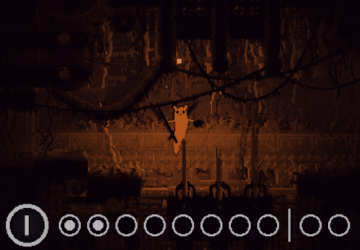

# KarmaAppetite 1.0  
  
  
  
This is a game mod for Rain World.  
**WORKS ONLY FOR v1.5!**  
(link to Downpour version coming "soon")
  
[RELEASE DOWNLOAD](https://github.com/Dark-Gran/KarmaAppetite/releases/tag/1.0)  

Use [WinRAR](https://www.google.com/search?q=winrar) or similar to extract .dlls from the archive.  
  
Installation: Uses ~~Partiality~~ Bepinex for compatibility.  
(**Unfortunately still not compatible with some/most other mods.** Will be fixed in the future.)  
  
If you want to learn about _everything_ I do, I'll be happy if you [follow me on my humble Twitter](https://twitter.com/DarkGran_CZ).  
  
[_(jump to source-code)_](#source-code)  
  
  
## Description
  
Meet the Archeologist, also known as the Pilgrim, the Adventurer (adventures not included), or the Tomb Raider: a crafty and hyperactive Slugcat that stumbled upon a karmic blessing... or a curse. Set up on a journey to Your favourite Iterators who will finally properly recognize You - and on the way, learn the importance of a nutritious breakfest.  
  
A composition of mods combining the Survivor/Hunter experience (and inspired by the many other Slugcats out there).  
Minor mods usable separately.  
Difficulty questionable (but most probably "hard").  
  
### Features  
- **Karma/Food/Stats scaling:** High Karma is difficult to sustain, but the energy leads to great power. No matter the Karma however, hungry Slugcat is extra weak - that grass you hopped through with ease in the evening will eat you in the morning!
(Higher Karma also provides some utility and removes ability prices (see below))
- **Spear proficiency:** Spear-on-back is a must-have for the Archeologist, and so is the ability to pull out spears stuck in walls, allowing him to get out of many tough spots. Almost any wall can be climbed! For a price. (Both mods optional, or usable separately)  
- **Extra inventory:** When you're swimming in ancient artifacts, you gotta learn how to handle them more efficiently. Forget storing only a single pearl - now you can store two! (Optional/usable-separately; size is configurable and potentially "unlimited") **THIS MOD IS NOT COMPATIBLE WITH SAVE-MODIFYING MODS (for example, CustomRegions).**  
- **Upgraded CraftingMod:** I took the liberty of building upon Pirate-Robs CraftingMod. Featuring crafting time, prices, and new recipes, including reverse engineering. Ever wanted to eat the glowing insides of a lantern, or just break your spear in half out of sheer frustration? Now you can! (**REQUIRES THE BASE MODULE TO FUNCTION**; [you may also want to try the independent original](https://drive.google.com/file/d/1Ncw1LacgQ2BIFJdovaphjtJKiaqBlaBs/view))  
- **Love for the Moon:** Did you know that when Moon likes Slugcat too much, she starts acting indifferent/neutral? Turns out one of her neurons was faulty, and she feels much better since it was replaced. Fixing the good old betrayal bug as well. (usable separately, but required for the main module to function)  
- **Playable on all difficulties.** (Monk gets more energy from fruits to compensate for the lack of fauna; Survivor (as default experience) expects the [HunterSpawns](https://drive.google.com/file/d/1VlO82XQMyXaY79xhIF2rRuiWxUYStPFu/view) mod (otherwise might need to move around a lot); Hunter is not affected by some of the mod's changes (eg. starting position) to ensure compatibility)  
  
### Submods Info  
**Extra inventory**  
The system of swallow/regurgitate has been reworked. The Slugcat now cares only about the item in the right hand: If there is one, the Slugcat will try to swallow it. If there isn't, the Slugcat will try to retrieve an item. (please forgive animations)  
The inventory works as a stack, which means the retrieved item will always be the last item swalloved.  
To adjust the size, create "extraInventory.txt" in game's root folder and place a number inside (it is _extra_ inventory, ie. default is 1, not 2).  
  
**Crafting Mod**  
The original mod was created by Pirate-Rob and I have merely built upon his work.  
Crafting is now done only by using the Q key (C removed) and the Slugcat must stand still and attempt the craft for a few seconds before receiving a result (even when the attempted recipe does not work).  
Creation of items usually has a price up to 1 full food point (until higher Karmas are reached), crafting is therefore recommended near a food source.  
As far as canon goes, the recipes are surprisingly lore-friendly, however I would consider all "crafted plants" to be artificial substitutes.  
Usually the difference in using creation in comparison to reverse-engineering is in how many items the Slugcat is holding, however there are exceptions.  
Some of the recipes:  
- Spear = Debris + Debris  
- Bomb = Cherrybomb + Bubblefruit/Debris  
- Explosive Spear = Spear + Bomb  
- Lantern = Glowmold + Bluefruit  
- Beebomb = Cherrybomb + Cherrybomb  
- Gasbomb = Mushroom + Mushroom  
- Flashbang = Jellyfish + Fruit  
- GrappleWorm = VultureWorm + Bluefruit  
- Neuron = Items related to iterators  
- Karma Flower = ??  
- Bomb ("Cherrybomb alternative path") = Items found near iterators (time to hunt in 5P-UD)  

### Power Comparison  
  
This section contains a frame of reference (imperfect), a comparison to other Slugcats.  
_You may want to find out about Archaeologist's potential in game._  
  

  
  
SPOILER

  
  **No food, any Karma**: Slower than Monk and can't even throw a spear properly: stucking it into walls/creatures requires a jump into melee distance.  
  **Max food, Karma 1-3**: +- Survivor  
  **Max food, Karma 5**: Glowing Hunter with a multiplied damage on spear.  
  **Max food, Karma 10**: Dances with Martyr. (on Karma 10, all bonuses are doubled)  
  Note: Karma 7 removes food price from crafting and spear-dislodge.
  

  
  
  
## Source Code
  
The code of all modules is open-source (atm with the exception of the Crafting Mod).  
Git Links:  
[KarmaAppetite_Base](https://github.com/Dark-Gran/KarmaAppetite_Base)  
[KarmaAppetite_ExtraInventory](https://github.com/Dark-Gran/KarmaAppetite_ExtraInventory)  
[KarmaAppetite_MoonFix](https://github.com/Dark-Gran/MoonFix)  
[KarmaAppetite_SpearOnBack](https://github.com/Dark-Gran/KarmaAppetite_SpearOnBack)  
[KarmaAppetite_SpearPull](https://github.com/Dark-Gran/KarmaAppetite_SpearPull)  

[_(jump back up)_](#karmaappetite)
